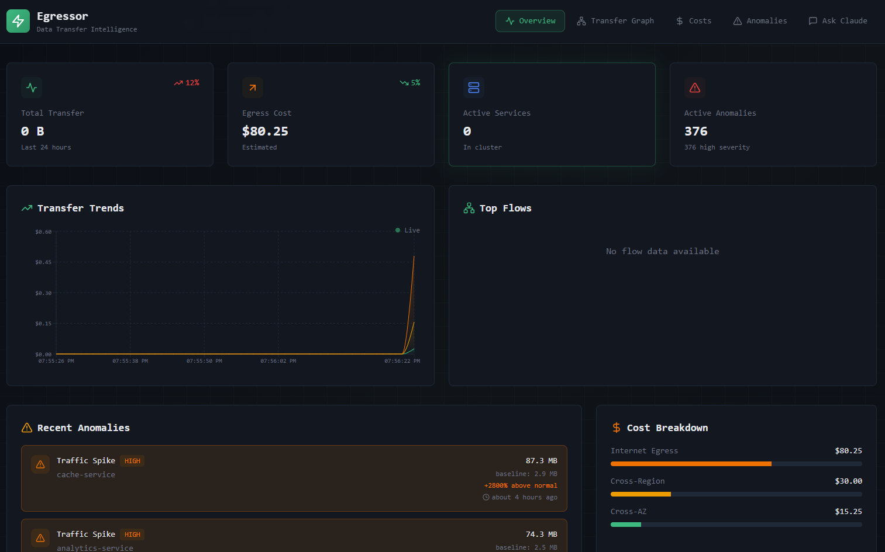
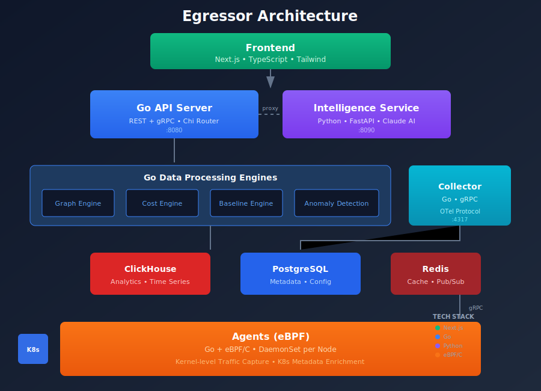

<h1 align="center">Egressor</h1>

<p align="center">
  <strong>Data Transfer Intelligence Platform</strong><br>
  Detect, explain, and reduce unexpected data transfer costs in Kubernetes
</p>

<p align="center">
  <a href="#features">Features</a> •
  <a href="#quick-start">Quick Start</a> •
  <a href="#architecture">Architecture</a> •
  <a href="#api">API</a> •
  <a href="#configuration">Configuration</a>
</p>

<p align="center">
  
</p>


---

## The Problem

Cloud egress bills are unpredictable. Services talk to each other in ways you didn't expect. Traffic spikes happen overnight. Nobody knows why costs tripled last month.

**Egressor answers:**
- *Where* is data moving?
- *How much* does each flow cost?
- *Why* did costs spike?
- *What* can we optimize?

## Features

| Feature | Description |
|---------|-------------|
| **eBPF Traffic Collection** | Zero-overhead kernel-level flow capture |
| **Real-time Visualization** | Live transfer graph  |
| **Cost Attribution** | Map traffic → AWS pricing → workload |
| **Anomaly Detection** | Automatic spike, slow-burn, and leak detection |
| **Claude AI Analysis** | Natural language investigation and optimization |
| **Kubernetes Native** | Pod, service, namespace attribution out of the box |

## Quick Start

```bash
# Clone
git clone https://github.com/phonginreallife/egressor
cd egressor

# Start all services (requires Docker)
docker-compose -f deploy/docker-compose.dev.yml up -d

# Generate mock data for testing
make mock-realtime

# Open dashboard
open http://localhost:3000
```

**Services:**
| Service | URL | Description |
|---------|-----|-------------|
| Dashboard | http://localhost:3000 | Next.js UI |
| API | http://localhost:8080 | Go REST API |
| Intelligence | http://localhost:8090 | Python Claude service |
| ClickHouse | localhost:9000 | Analytics DB |
| PostgreSQL | localhost:5432 | Metadata DB |

## Architecture

<p align="center">
  
</p>

## API

### Graph
```bash
GET /api/v1/graph              # Full transfer graph
GET /api/v1/graph/stats        # Node/edge counts, bytes
GET /api/v1/graph/top-edges    # Highest traffic flows
```

### Costs
```bash
GET /api/v1/costs/summary      # Total, egress, cross-region costs
GET /api/v1/costs/attribution  # Cost by service
```

### Anomalies
```bash
GET /api/v1/anomalies          # All detected anomalies
GET /api/v1/anomalies/active   # Currently active
POST /api/v1/anomalies/{id}/acknowledge
```

### Intelligence (Claude)
```bash
POST /api/v1/intelligence/analyze   # System analysis
POST /api/v1/intelligence/ask       # Ask anything
```

### Testing
```bash
POST /api/v1/mock/generate?count=100  # Generate mock flows
POST /api/v1/mock/anomaly             # Generate anomaly
DELETE /api/v1/mock/reset             # Clear mock data
```

## Configuration

| Variable | Description | Default |
|----------|-------------|---------|
| `EGRESSOR_CLICKHOUSE_DSN` | ClickHouse connection | `clickhouse://localhost:9000/egressor` |
| `EGRESSOR_POSTGRES_DSN` | PostgreSQL connection | `postgres://localhost:5432/egressor` |
| `EGRESSOR_ANTHROPIC_API_KEY` | Claude API key | - |
| `EGRESSOR_DEBUG` | Debug logging | `false` |

## 🛠️ Development

```bash
# Build Go binaries
make build

# Run tests
make test-go

# Generate mock data (runs continuously)
make mock-realtime

# Single mock data batch
make mock-data

# View logs
make dev-logs
```

## Security

- **eBPF requires privileged access** — Agent runs as DaemonSet with elevated permissions
- **Metadata only** — No deep packet inspection, never captures payload content  
- **Claude receives summaries** — Raw traffic data never leaves your infrastructure

## Tech Stack

| Layer | Technology |
|-------|------------|
| Traffic Collection | eBPF (C) + Go |
| Backend | Go 1.22, Chi router |
| Analytics DB | ClickHouse |
| Metadata DB | PostgreSQL |
| AI/Intelligence | Python, Claude API |
| Frontend | Next.js 14, TypeScript, Tailwind |
| Visualization | Recharts, Custom SVG |

## License

Apache 2.0

---

<p align="center">
  Built with ☕ and Claude
</p>
